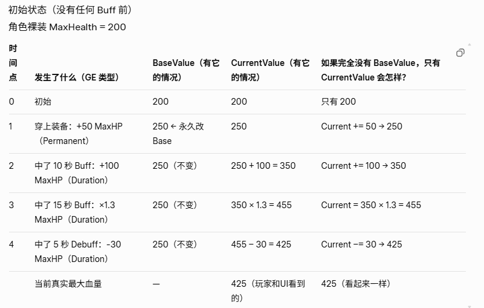
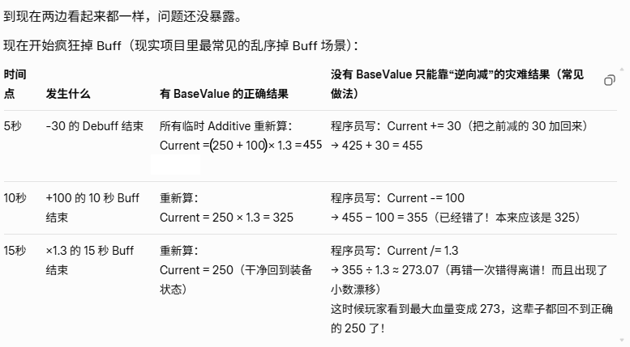

# UAttributeSet
## 一. 两个重要成员变量
    BaseValue: 系统临时值,“锚点”，专门用来对抗“临时效果叠得太乱”导致的属性漂移问题。确保 Buff/Debuff 结束之后能恢复到原来的状态。
    CurrentValue: 实际业务变量，计算等判定关系，如，UI、伤害、回血、死亡判断

eg：Buff/Debuff 乱序结束，如果没有BaseValue，会无法亏到原来的状态。

