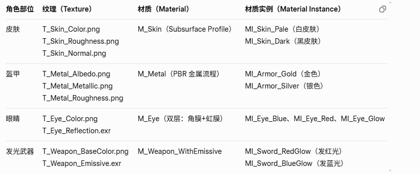

# 纹理（Texture），材质（Material），材质实例（Material Instance）,网格（Mesh，包括蒙皮 Mesh）,骨骼（Skeleton）,Skin / Skinning（蒙皮）,骨骼网格体（Skeletal Mesh）相关知识

# 材质相关

## 纹理（Texture）
纹理是纯图片资源，没有任何逻辑，通常为：
    Diffuse / BaseColor（颜色）
    Normal Map（法线）
    Roughness（金属粗糙度）
    Metallic（金属度）
    Specular（高光）
    Mask（遮罩贴图，R/G/B/A 用来控制不同内容）
它只是像素数据，作用就是提供材质要用的图像信息。
📌 Texture 不包含模型信息，不包含材质逻辑。
-----------------------------------------------------------------------------------------------------------------------------------------

## 材质（Material）
材质是一个 函数图（Shader Graph），用来定义：
    如何使用纹理（Texture）
    贴图如何组合
    使用什么光照模型
    是否透明、是否有折射
    是否使用法线
    是否做 PBR 光照
    是否支持动画（如世界位置偏移 WPO）
材质是“着色器模板（Shader Template）”。
你可以在 Material 里输入各种 Texture，也可以不用 Texture 直接用颜色、数学公式生成效果。
📌 Material 是不能直接改变颜色的，本身参数是固定的。
-----------------------------------------------------------------------------------------------------------------------------------------

## 材质实例（Material Instance）
材质实例是 对材质进行参数化的副本。
特点：
    不重新编译 Shader
    运行时开销极低
    可以随时修改材质参数，例如：
        BaseColor
        Roughness
        EmissiveColor
        Scalar（浮点）
        Vector（颜色）
        Texture（贴图）

例如：
🔹 原始材质（M_Character）
    定义：
        BaseColor = Parameter(Color)
        EmissiveStrength = Parameter(Scalar)
        MaskTexture = Parameter(Texture)

🔹 材质实例（MI_EnemyRed）
    BaseColor = 红色
    EmissiveStrength = 5
    MaskTexture = enemyMask.png

📌 实例化就是给材质赋不同的值，使同一材质适配不同角色。

# 总结
    Texture（贴图）
        ↓ 作为输入
    Material（材质）
        ↓ 实例化赋值
    Material Instance（材质实例,通过修改材质参数，可生成多个材质实例）

# ~~~~~~~~~~~~~~~~~~~~~~~~~~~~~~~~~~~~~~~~~~~~~~~~~~~~~~~~~~~~~~~~~~~~~~~~~~~~~~~~~~~~~~~~~~~~~~~~~~~~~~~~~~~~~~~~~~~~~~~~~~~~~~~~~~~~~

# 模型相关

## 网格（Mesh，包括蒙皮 Mesh）
Mesh 是一个 3D 模型，包含：
    顶点（Vertex）
    三角形（Triangle）
    UV（纹理坐标）
    顶点法线 / 切线

静态网格（Static Mesh）
    没有骨骼，只用来显示建筑、道具等。

骨骼网格（Skeletal Mesh）
    带骨骼，可以播放动画，例如：
                            角色
                            怪物
                            武器（如枪械上有骨骼）
📌 Mesh 只是个模型。
-----------------------------------------------------------------------------------------------------------------------------------------

## 骨骼（Skeleton）
    Skeleton 是一棵 节点层级结构（Bone Hierarchy）：
    例：
        Root
        └─ Pelvis
            ├─ Spine1
            ├─ Spine2
            └─ Head

骨骼作用：
    让动画变形网格
    动画资产依附于骨骼（Animation Sequence、Montage、BlendSpace）
    Retarget（重定向）

📌 Skeleton 只有“骨架数据”，不包含模型。
-----------------------------------------------------------------------------------------------------------------------------------------

## Skin / Skinning（蒙皮）
蒙皮（Skinning）是：
    把网格（Mesh）的每个顶点绑定到骨骼，使骨骼动时网格跟着动。

例如：
    顶点 A：80% 受 Spine 控制，20% 受 Head 控制
    顶点 B：100% 受 Arm 控制
    这是 DCC 工具（Maya、Blender）里完成的。

📌 Skin 是骨骼和网格整合参数。
-----------------------------------------------------------------------------------------------------------------------------------------

## 骨骼网格体（Skeletal Mesh）
这是：
    网格（Mesh） + 骨骼（Skeleton）+ 蒙皮信息（Skin weight）

完整包含：
    模型数据
    骨骼层级结构
    每个顶点绑定到哪些骨骼（Weight）
    可用于播放动画

📌 在 UE 中 Skeletal Mesh 是能播放动画的最终角色模型资产。
-----------------------------------------------------------------------------------------------------------------------------------------

# 总结：
    Mesh（网格：模型）
        + Skeleton（骨骼）
            + Skin（顶点权重）
    = Skeletal Mesh（骨骼网格体，可播放动画）
===============================================================================================================================================

🔻 最终组合（角色）
Character
  ├─ Skeletal Mesh（带骨骼）
  │     └─ 使用材质实例（可以替换贴图/颜色/蒙皮光效）
  └─ Animation Blueprint（驱动骨骼动画）

# 即为：
【Texture】 —► 输入贴图
    │
    ▼
【Material】 —► 定义渲染公式
    │
    ▼
【Material Instance】 —► 实际用在 Mesh 上的材质

----------------------------------------------

【Skeleton】 —► 骨骼
【Mesh】 —► 模型顶点
【Skin Weight】 —► 顶点绑定权重
    │
    ▼
【Skeletal Mesh】 —► 可播放动画的角色模型

