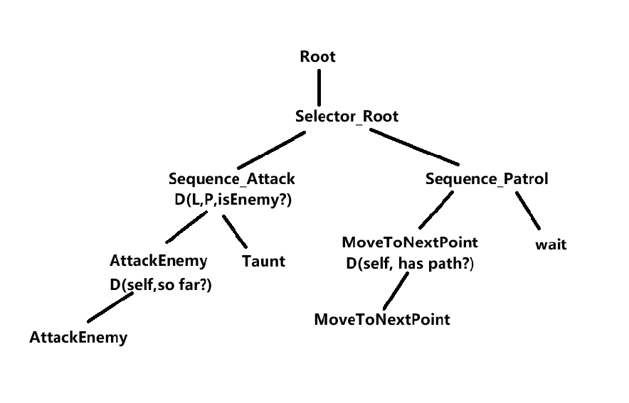

# Dungeon-Hunter
ue5
Animation:动画
AnimGraph（动画图）
这是 AnimInstance 中最核心的一部分。
    ✔ AnimGraph 负责：
        组合不同动画姿势（Blend）
        控制动画切换
        调用状态机
        调用 Slot 播放 Montage
        IK、FABRIK、AimOffset 等节点
        输出最终姿势

AnimGraph 输出的最终 Pose
    |
    |-- State Machine（走路、跑步、跳跃）
    |
    |-- Slot (播放攻击、受击 Montage)
    |
    |-- IK、Ragdoll、Layered blend per bone
    |
    ----> 输出Final Animation Pose

State Machine（状态机）
    状态机是 AnimGraph 里面的一个节点。
    用途：管理“移动相关”或“流程状态相关”的动画逻辑。
    常见状态：
    Idle
    ↓
    Walk
    ↓
    Run
    ↓
    JumpStart → JumpLoop → JumpEnd
    ↓
    Land

Slot（插槽）与 DefaultSlot
Slot 是专门用来播放 Montage（动作专辑） 的。
    ✔ Slot 典型用途：
        攻击动画
        技能动画
        受击动画
        开枪动作
        换弹动画
        表情动画
        Slot 会插入在 AnimGraph 某个位置，使 montage 能覆盖或混合基础动画。
 
eg:       
基本移动状态（来自 State Machine）
          ↓
Montage Slot（DefaultSlot）
          ↓
Layered blend per bone（上半身）

最终Pose = StateMachine + Slot(Montage)

如果你不创建自己的 Slot，那么播放 Montage 都会走 DefaultSlot。
✔ Slot 的执行优先级比状态机高。
    状态机是基础动作：走、跑、跳。
    Slot 是瞬时动作：攻击、受击、开枪。

⭐ 三者之间的关系（非常关键）
    1）AnimInstance
    动画逻辑 + 动画图执行
    （最顶层程序）

    2）AnimGraph
    控制最终输出哪种动画
    （主树）

    3）State Machine
    移动状态控制
    （底层Pose来源）

    4）Slot
    Montage 播放（优先级覆盖状态机）
    （用于技能/攻击/受击）

| 名称                    | 作用                 | 用途                                 |
| ---------------------- | ---------------------| ------------------------------------ |
| **AnimInstance**       | 动画蓝图的代码逻辑类  | 运行 AnimGraph、管理技能动画、参数更新 |
| **AnimGraph**          | 最终动画输出管线      | 混合、IK、状态机、Montage、Slot       |
| **State Machine**      | 管理角色移动/姿态状态 | Idle/Run/Jump 等持续动画             |
| **Slot / DefaultSlot** | 播放 Montage         | 攻击、技能、受击、开枪                |

ASC：
1. 每个玩家分别拥有自己的 ASC
2. 服务器拥有所有人的 ASC

ASC有客户端和服务器之分
    ✔ 所有的广播行为都在服务器。
    ❌ 客户端无论如何不能触发广播
    ✔ 客户端带预测键 → 服务器如果接受请求 → 服务器广播
    ❌ 客户端无预测键 → 服务器不接受、不执行、不广播

| 操作                    | 客户端触发是否广播？                           | 服务器触发是否广播？    | 是否由 ASC 决定？      |
| ------------------------| ---------------------------------------------| ----------------------| -------------------- |
| **属性修改**            | ❌ 不广播 → 本地预测                          | ✔ 广播                | ✔ 完全由 ASC 驱动      |
| **GameplayEffect 应用** | ❌ 本地预测，不广播                           | ✔ 广播                | ✔ GE 存储在 ASC        |
| **GameplayCue**         | ❌ LocalCue 不广播                           | ✔ 广播特效/音效       | ✔ CueManager 在 ASC 下 |
| **Ability 激活**        | ❌ 无预测键不会广播✔, 有预测键 → 服务器广播    | ✔ 广播                | ✔ AbilitySpec 在 ASC  |
| **Tag 变化**            | ❌ 客户端不能改                               | ✔ GE 或服务器修改广播 | ✔ Tag 容器在 ASC       |

| 类型                                      | 发起者会收到自己的同步吗 | 原因                          |
| -----------------------------------------| ----------------------- | ------------------------------|
| 属性同步                                  | ✔ 会                   | 客户端预测 vs 服务器权威       |
| GameplayEffect 结果                       | ✔ 会                   | 同步数值与状态                |
| GameplayCue                               | ✔ 会                   | 确保 visual 效果一致          |
| Server RPC（如 ServerTryActivateAbility） | ❌ 不会                 | 客户端只发送，不需要回放       |
| 普通多播（Multicast）                      | ✔ 会                   | 服务器给所有客户端广播包括自己  |

UGameplayAbility技能预测：

UGameplayAbility下的NetExecutionPolicy模式：它有4个成员变量
| NetExecutionPolicy  | 执行位置                                | 作用   
| ------------------- | ---------------------                   |---------------------
| **Local**           | 只在本地（客户端或服务器）执行，不网络同步 |
| **ServerOnly**      | 只在服务器执行                          |
| **LocalPredicted**  | 客户端执行 + 服务器验证（预测）           |客户端先执行ActivateAbility，然后服务器再ActivateAbility
| **ServerInitiated** | 服务器触发，客户端仅收到结果              |

标签设置:
1. 资产标签（Ability Tags）
    GA 自身的“身份证”，可多个。
    描述该能力自身的身份、类型、分类。
    如：
    Ability.Attack.Melee
    Ability.Skill.Fireball

    AbilityTags为能力的成员变量
    AbilityTags.AddTag(FGameplayTag::RequestGameplayTag(TEXT("Ability.Attack.Melee")));
    AbilityTags.AddTag(FGameplayTag::RequestGameplayTag(TEXT("Ability.Type.Skill")));

2. 取消带标签的能力（Cancel Abilities With Tags）
    当这个能力激活时，会主动取消所有(资产标签)具有这些标签的能力,一激活就执行一次扫表打断
    如果Cancel Abilities With Tags==Ability.Attack,那么正在进行中、拥有 Ability.Attack 标签的技能，立即被中断并强制 EndAbility。

3. 用标签阻止能力（Block Abilities With Tags）
    当此能力 正在激活 时，它会阻止拥有这些标签(资产标签)的能力尝试激活,任何试图进入激活流程且带匹配标签的 GA（已激活的不受影响）,只要本 GA 还处于 “Active” 就把它们挡在 CanActivate 之外 

4. 激活标签已拥有的能力（Activation Owned Tags）
    当该能力 成功激活后，这些标签被加到角色 ASC 上，能力结束时自动移除。

5. 激活标签所需标签（Activation Required Tags）
    激活能力前，ASC 上 必须拥有这些标签。如果缺少 → 不能激活。

6. 激活阻止标签（Activation Blocked Tags）
    如果角色 ASC 拥有这些标签，则能力 不能激活。

7. 源所需标签（Source Required Tags）
    技能施法者必须拥有这些标签，能力才可以执行其效果。

8. 目标所需标签（Target Required Tags）
    目标必须有这些标签，技能效果才能生效。
    用于：
    ·组合技
    ·特定状态触发效果
9. 目标被阻止标签（Target Blocked Tags）
    如果目标拥有这些标签，则技能效果不会生效。

一、行为树：
节点有3个状态
    Running（正在执行中）
    Succeeded（成功）
    Failed（失败）

执行规则：
一个节点运行完毕后，行为树会逐层往上返回结果，并让上层节点决定接下来的行为。
如：一个字节汇报给Sequence父节点，父节点决定继续运行其他的子节点

二、父节点类型：
Selector 、 Sequence 、Parallel

Selector：单任务类型，分支上的所有节点，只要有一个执行成功则，停止接下来的运行。
Sequence：单任务类型，分支上的所有节点，只要有一个执行失败则，停止接下来的运行。
Parallel：并行任务，主任务（Main Task） 阻塞整个节点直到它完成；背景树（Background Branch） 里的所有子任务 与主任务并行执行；节点最终成功/失败 只看主任务结果（背景树成败不影响）。

注意！成功和失败的定义不是装饰器的条件，而是 EBTNodeResult 返回的结果，即为，成功→FinishExecute(true) ；失败→FinishExecute(false)

eg：
Sequence
 ├── Task A
 ├── Task B
 └── Task C
 如果：
    A:Success
    B:Failure
    C:不再执行
    整棵Sequence返回执行完毕结果

Selector
 ├── Task A
 ├── Task B
 └── Task C

  如果：
    A:Failure
    B:Success
    C:不再执行
    整棵Selector返回执行完毕结果

Parallel
├─ 主任务: Task A （MoveTo，需 5 秒）
└─ 背景分支: Sequence
    ├─ Task B （每 0.5s 打印一次）
    └─ Task C （每 1s 播放音效）
    直到Task A完成，整棵Parallel返回执行完毕结果

三、装饰器：
某些装饰器可以设置为动态评估（Observer Aborts）。
这控制了运行过程中装饰器条件是否会被重新检查

| 检查时机                      | 说明             |
| ------------------------      | -------------- |
| **节点执行前**                | 决定节点是否能进入。     |
| **运行中（Observer Aborts）** | 决定是否中断自己或兄弟节点。 |
| **Blackboard变化时**          | 自动触发重新评估条件。    |

    
3.1、通知观察者：
    是否进行重新评估？
    1,OnResultChange 结果改变时：条件翻转时候触发。
    2,OnValueChange 值改变时：SetValue ，内存写一下就触发，无论是否黑板键值是否和旧的重复。
        eg:黑板键float类型 ，条件：Health > 50.0，上一帧 Evaluate 结果：false（因为 Health=40）
        | 时刻 | Health 新值 | 数值变了吗？| 返回值变了吗？ | OnResultChange 触发？ | OnValueChange 触发?|
        | --- | ----------- | ------    | ------------   | ------------------    |-------------------
        | t=1 | 40 → **40** | ❌ 相同   | ❌ 仍为 false  | ❌ **不触发**         |✅ **触发**（翻转）|
        | t=2 | 40 → **60** | ✅ 不同   | ✅ false→true  | ✅ **触发**（翻转）   |✅ **触发**（翻转）|
        | t=3 | 60 → **80** | ✅ 不同   | ❌ 仍为 true   | ❌ **不触发**（无翻转）|✅ **触发**（翻转）|

3.2、观察者中止：
经过评估后，如何行为？
| 模式                | 谁触发中断？                     | 触发时的行为                  |
| ------------------ | -------------------------------- | ---------------------------- |
| **None**           | 永不触发                         | 不动态重新评估。                |
| **Self**           | 自己条件变为 false               | 中断自己（当前分支）。             |
| **Lower Priority** | 自己条件变为 false→true          | 中断该装饰器右边/优先级更低的分支。 |
| **Both**           | 条件翻转,变为 false/true         | 同时触发 Self 和 Lower Priority ，综合两种行为。|

    1，None :只在节点开始前检查一次，不会动态中断
    2，Self :当前节点运行期间，如果装饰器条件变为 false，会中断该节点（自己）
            ·触发条件：装饰器条件从真→假，时触发
    3，Lower Priority：
            ·作用：只打断“同一父节点下的右侧兄弟
            ·触发条件：装饰器条件从假→真，时触发

    4，Both：
        ·触发条件：真→假或者假→真时触发(双向)

检查范围和时机
1，检查的位置和时机 和正在运行的节点有关
2，检查的路径和激活的路径相关，在这个Root到running Node路径上所有节点，以及这些节点的儿子子节点的所有装饰器。
3，检查的时机，分两种，Blackboard Key 值变化（Observer 机制）和每帧检查（部分装饰器类型或自定义条件）
    | 类型                        | 触发条件                               | 作用对象          |
    | ----------------------      | -------------------------------       | ---------------- |
    | **事件驱动（Event-driven）** | Blackboard Key 值变化（Observer 机制） | 所有依赖该 Key 的活跃装饰器 |
    | **周期检查（Tick-driven）**  | 每帧检查（部分装饰器类型或自定义条件）   | 当前激活路径上的装饰器      |

eg：宠物AI行为
                                                      Root
                                                       |     
                                             ———— Selector_Root ————————
                                            |                           |
                Sequence_Attack(D:LP,IsEnemyVisible)                 Sequence_Patrol
                                    |                                       |
                        ———————————————————————                      ————————————————————————————————
                       |                      |                     |                                |
AttackEnemy(D:self,IsInAttackRange)         Taunt         MoveToNextPoint(D:self,HasPatrolPath)     Wait

阶段1：
    初始状态（敌人不可见），进行巡逻行为
    IsEnemyVisible = false
    HasPatrolPath = true
    激活路径：Root → Selector_Root → Sequence_Patrol → MoveToNextPoint
此时会检查：激活路径上节点以及儿子节点的所有装饰器，即，MoveToNextPoint，Sequence_Attack。

阶段 2：
    敌人出现
    IsEnemyVisible = false → true
    因为D:LP，则打断之前的MoveToNextPoint。
    IsInAttackRange = false
    激活路径：Root → Selector_Root → Sequence_Attack → Taunt

阶段 3：
    攻击阶段中（敌人在攻击范围内）
    IsInAttackRange=false → true
    等待Taunt运行结束，结束后，→汇报Sequence_Attack → 汇报Selector_Root→ 汇报Root，root重新评估
    IsEnemyVisible = true
    激活路径：Root → Selector_Root → Sequence_Attack → AttackEnemy

阶段 4：
    敌人消失
    IsEnemyVisible = true → false
    中断AttackEnemy，如果放回值是FinishExecute(true)，则进行Taunt，否则父节点重新层层向上汇报，重新评估

EQS:

一、Generator
1）Points: Circle（圆形）
    选项包含：
    半径（Radius）
    间隔角度（Angle Step）
    点数量限制
    方向（Clockwise/Counter）
    在导航网格上贴合（Project to Navmesh）

2）Points: Grid（正方形格子）
    Cell Size
    Grid Size
    2D / 3D

3）Points: Donut（环形）
    内外半径
    采样点数量

4）Points: Pathing Grid
    基于导航网格生成点（对 AI 最友好）

5）Actors of Class
    指定类（例如找到场上所有 NPC、所有敌人）
    距离过滤
    是否 Project 到 navmesh

6）Single Item
    例如 Target Actor 的位置

GameplayCue：
它到底解决了什么
1. 统一的视觉/音效触发系统
    在 GAS 中，各种技能、Buff、状态都会触发视觉效果（VFX）、音效（SFX）、动画、材质变化等。
    如果每个技能都自己写蓝图或 C++ 来播放粒子、播放音效，就会导致：
    ✔ 大量重复代码
    ✔ 难以同步客户端和服务器
    ✔ 维护成本高
    ✔ 预测和回滚无法同步特效

2. 解决同步问题（服务端、客户端、预测）
    GameplayCue 有网络同步能力：
    带宽：不用把粒子、音效等资产路径 RPC 过去，只同步一个短 Tag。
    Server 激活 Cue → 自动同步到所有相关客户端
    预测能力：客户端提前显示效果，回滚自动清除
    避免多人对战中技能特效不同步

3. 解决效果配置混乱问题
    大部分效果如：
    中毒 Buff 的绿色雾气
    暴击数字 + UI
    火球命中特效
    受到治疗的亮光
    都能通过 GC 配置，自动从 GA / GE / Attribute 中触发。
    不需要每次写代码播放 VFX。

|       函数                      |              作用                                |    常用场景
|------------------------------- |--------------------------------------------------|-----------------------
|ExecuteGameplayCue              |立即完整播放一次（OnActive → OnExecute → OnRemove） |枪口火焰、开枪声音
|AddGameplayCue                  |添加一个持续的 Cue（OnActive → 持续 → OnRemove）    |燃烧状态的火焰粒子、持续治疗光环
|RemoveGameplayCue               |手动移除一个正在持续的 Cue                          |提前结束燃烧效果
|ExecuteGameplayCueWithParams    |带参数的执行（可以传伤害值、位置、强度等）            |暴击时更大的爆炸、根据伤害调整粒子大小

NetExecutionPolicy：
|           策略,                 |  含义,                                           |   谁会先运行 Ability 代码？
|------------------------------- |--------------------------------------------------|-----------------------
|   LocalOnly,                   |只在本地运行，不发服务器                            |客户端
|   LocalPredicted（推荐）        |客户端先预测运行 → 发服务器验证 → 服务器再运行一次    |客户端先跑，服务器后跑
|   ServerInitiated              |只有服务器能激活，客户端等通知                       |只有服务器
|   ServerOnly                   |只有服务器运行，客户端永远不跑                       |只有服务器

防止特效重播问题：
bIsPredictable=true :
    “我这个 GameplayCue 允许被客户端提前预测播放吗？”
    如果设为 true，客户端会在本地预测命中的那一帧立刻调用 OnExecute。
    如果设为 false，客户端必须等服务器 Rep 回来才敢播放（延迟 50~200ms）
bAllowPrediction=true
    “即使服务器最终拒绝了这次预测（比如作弊、穿模、被闪避），我允许客户端先播放再撤回吗？”
    true = 先播再撤（几乎感觉不到撤回）
    false = 永远不预测，只听服务器（延迟高）

Execute = 播一次就结束。
Add/Remove 用来播放持续特效（如持续燃烧）。

1，GE 自带
    在 GE 的 Gameplay Cue Tags 数组里填 Tag，GE 被成功应用时自动 Execute/Add，移除时自动 Remove。
2，手动触发
    在 Ability 或任意地方拿 ASC 调：
    ExecuteGameplayCue(Tag, Params);   // 一次性
    AddGameplayCue   / RemoveGameplayCue   // 持续型

3，自定义 Notify
    新建 Blueprint/C++ 类继承 UGameplayCueNotify_Static（无场景）或 AGameplayCueNotify_Actor（需放场景），重载 OnActive / WhileActive / OnRemove / OnExecute，在里面播特效、音效、动画、UI 抖屏都行。
    OnActive(开始时触发)：
        回调触发：
        ASC->AddGameplayCue(Tag, Params)
        Duration/Periodic/Infinite 类型的 GE 被成功 Applied（服务器自动调 Add）行为
        每一个 GC 实例只执行一次，相当于“构造函数”
        服务器通过 NetMulticast_InvokeGameplayCueAdded 把 Tag 广播给所有客户端

    OnExecute ：
    回调触发：
        ASC->ExecuteGameplayCue(Tag, Params) 时
        任何 Instant 类型的 GameplayEffect（Duration = 0）被成功 Apply行为
        客户端本地立即执行一次，不会再走 Add/Remove 流程
        服务器通过 ASC 的不可靠多播 NetMulticast_InvokeGameplayCueExecuted 把事件带下来

    WhileActive：
    Buff 存在时播放，移除时停止。
    通常绑定到 GameplayEffect 的持续效果。
    比如：持续减速时在脚下播放冰霜特效。

    OnRemove（当 Effect 移除时触发）

4，批量化 & 条件跳过
    霰弹枪 8 发弹丸：用 FScopedGameplayCueSendContext 把 8 个 GC 压成 1 个自定义 RPC，在客户端本地再拆成 8 个本地 GC。
    格挡/无敌不想播受击：在 GameplayEffectExecutionCalculation 里调 OutExecutionOutput.MarkGameplayCuesHandledManually()，然后手动发你想要的 GC。
    某角色永久不想播任何 GC：ASC->bSuppressGameplayCues = true。