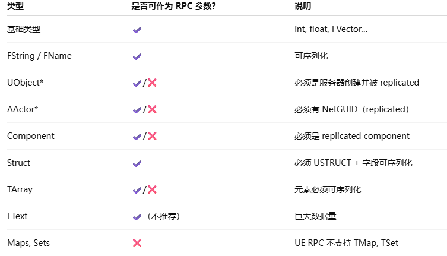

## UFUNCTION: 函数标识
## 一、网络同步族

参数:
1. Server
    客户端 → 服务器；调用端必须是本地 ROLE_AutonomousProxy。

    客户端调用 xxx，触发服务器执行：xxx_Implementation

    客户端：
    只是包装 RPC 并发送 （不执行逻辑）
    服务器：
    只执行 _Implementation 部分

eg:
    UFUNCTION(Server, Reliable)
    void ServerFire(const FVector& AimDir);   // 客户端调用，只在服务器跑

    // 普通写法，完全看不出“网络”痕迹
    void AMyWeapon::DoSome()
    {D
        // 客户端按键瞬间调用
        ServerFire(GetAdjustedAim());相当于自己调用了ServerFire_Implementation
    }

    void AMyWeapon::ServerFire_Implementation(const FVector& AimDir)
    {
        // 真正射线检测、扣血、生成子弹都在这里
        ...
        // 服务器想让“开枪的人”看火花
        ClientSpawnMuzzleFX();
    }

    编译器生成的桩代码（在 *.gen.cpp 里）大致长这样：
    void AMyWeapon::ServerFire(const FVector& AimDir)
    {
        if (Role < ROLE_Authority)        // 不是服务器
            GetNetDriver()->SendRPC(this, ...);  // 打包 RPC，发送请求
        else
            ServerFire_Implementation(AimDir);   // 本地直接调
    }

2. Client
    服务器 → 单个客户端（Owning Client）；调用端必须是 ROLE_Authority。

    服务器调用 xxx，触发客户端执行：xxx_Implementation
3. NetMulticast
    服务器 → 所有已同步副本（包括服务器自己）。

    服务器调用 xxx，触发所有客户端以及服务器执行：xxx_Implementation

    常见用法：
    服务器生成爆炸，想让所有客户端一起播特效。
    函数体里最好只做“表现”逻辑，别改重要游戏状态。
4. Reliable / Unreliable
    必须和上面三个之一成对出现，是否可靠传输,决定通道是否重发。

任何端不该由你手动去调 ServerFire_Implementation()，因为ServerFire_Implementation()是自动触发的，否则逻辑就“短路”了
5. 函数体参数要求：
    RPC 参数必须满足：
    ✔ 能写进 FArchive（网络流）
    ✔ 服务器能重建该对象或数据
    ✔ 不能传本地对象（没有 NetGUID）
    ✔ 不能传不能序列化的容器
    ✔ 传数据比传对象更安全
    即为：
    1. 必须是可网络序列化的类型
    ✔ 基础类型(因为是基本数据类型，可以直接序列化，可以无需NetGUID)： 
        bool,int32, int64, float, double,FVector, FRotator, FQuat（UE 内置支持 NetSerialize）
        FString, FName, FText(不推荐)
        FVector_NetQuantize (网络优化)
    UE 可序列化结构体,且结构体内的字段必须是可序列化的。
    如：
        USTRUCT(BlueprintType)
        struct FMyStruct
        {
            GENERATED_BODY()

            UPROPERTY()
            int32 Example;
        };
    
    对象类型（必须要有NetGUID）：服务器需要找到对应 Actor
        如果 Object：
            1. 不被服务器管理
            2. 不 replicates
            3. 不是 subobject
            则不会分配 NetGUID → RPC 参数丢失。

    2. 不能传递本地对象（客户端自己创建的对象）
        ⚠ 只有“已被服务器创建并在客户端 replicated 的对象” 才能作为 RPC 参数传递

        ✔ 可传：
        玩家控制的 Character
        服务器生成并同步的 Projectile
        replicated 的 Component

        ❌ 不可传：
        客户端自己 Spawn 的 Actor
        非 replicated 的 Actor (不经过服务器 Spawn)
        client-side-only components
        临时 UObject
        UE 要求对象必须能被 NetGUID 识别，否则 RPC 会被丢弃。
    3. 不能传引用类型
    void ServerFire(const FVector& AimDir);  // 虽然可以编译，但引用会被复制成值！
    ⚠ UE 会自动复制引用，RPC 实际上传输的是值，不是引用
    
    4. 不能传 TArray<T> 中包含不可序列化的类型
        

| 类型             | 是否可作为 RPC 参数？ | 说明                       |
| --------------- | ------------- | ------------------------ |
| 基础类型            | ✔             | int, float, FVector…     |
| FString / FName | ✔             | 可序列化                     |
| UObject*        | ✔/❌           | 必须是服务器创建并被 replicated    |
| AActor*         | ✔/❌           | 必须有 NetGUID（replicated）  |
| Component       | ✔/❌           | 必须是 replicated component |
| Struct          | ✔             | 必须 USTRUCT + 字段可序列化      |
| TArray          | ✔/❌           | 元素必须可序列化                 |
| FText           | ✔（不推荐）        | 巨大数据量                    |
| Maps, Sets      | ❌             | UE RPC 不支持 TMap, TSet    |

## 二、线程与调用时机族

1. BlueprintCallable
    蓝图可调用，但 C++ 实现必须存在；这是最常用的“把函数暴露给蓝图”入口。
2. BlueprintPure
    蓝图可调用，且无副作用（不会改成员、不抛事件），可被编译器重复折叠；
    典型：GetHealth、GetActorForwardVector。
3. BlueprintImplementableEvent
    C++ 只有声明，实现由蓝图完成；
    常用于“模板方法”——C++ 在关键节点喊一嗓子，蓝图爱干啥干啥。
4. BlueprintNativeEvent
    双轨：C++ 提供默认实现 (_Implementation)，蓝图可Override；
    调用时先找蓝图节点，没有再回落到 C++。
    eg:
    UFUNCTION(BlueprintNativeEvent, BlueprintCallable)
    void OnTakeDamage(float Dmg);
    // 默认实现
    void OnTakeDamage_Implementation(float Dmg){ ... }

5. CallInEditor
    让蓝图函数在细节面板里就能点按钮执行，无需 PIE；
    只在 BlueprintCallable 且静态或 const 时生效。
5. Exec
    把函数注册进 控制台 (~ 键)；
    必须是 static 且参数为 FWorldContext 或基本类型。

    eg:
    UFUNCTION(Exec)
    static void MyCheat(FString Msg);

## 三、权限与安全性族
1. WithValidation（已隐形）
    自动生成 bool ValidateXXX(...)，可在服务器收到 RPC 时提前拒绝，防外挂。
2. BlueprintAuthorityOnly
    蓝图节点只能在权威端（服务器）调用；客户端调了会直接返回默认值。

## 四、性能/优化族
1. Const
    保证函数不修改对象状态（等价 C++ const），蓝图侧可节点折叠、线程安全。
2. BlueprintInternalUseOnly
    节点会出现在蓝图，但隐藏在“上下文敏感”之外，用户搜不到；
    用于内部辅助函数。
3. DevelopmentOnly
    编译 Shipping 时整段裁掉，连符号都不留；
    调试用 Log、性能探头常用。

## 五、反射/细节面板族
1. Category
    把函数归到蓝图面板指定目录：
    Category="Game|Weapon|Fire"
2. DisplayName / Tooltip / Keywords
    蓝图节点友好名、悬浮提示、搜索关键字。
3. CompactNodeTitle
    让蓝图节点极简显示，例如“+”、“×”。
4. HidePin / HideSelfPin
    自动隐藏默认引脚，减少蓝图视觉噪声。

## 六、异步与 latent 族
1. Latent
    告诉蓝图“这个函数会阻塞一段时间”，需要 FLatentActionInfo 参数；
    官方自带 Delay、MoveComponentTo 等节点就是靠它。
2. LatentInfo（内部）
    与 Latent 搭配，用户不用手写。

## 七、元音 tag 区（meta = (...)）
虽然不在主括号，但经常混写，顺手列最常用的：
1. meta = (CallableWithoutWorldContext)
    允许无世界上下文就调，常用于蓝图库。

2. meta = (WorldContext = "WorldContextObject")
    指定哪个参数当世界上下文，解决静态函数拿 UWorld 的问题。

3. meta = (DeterminesOutputType = "ActorClass")
    告诉蓝图“返回类型依赖这个输入引脚”，节点输出引脚可动态变类型。

4. meta = (AutoCreateRefTerm)
    把 const F& 参数在蓝图侧自动创建局部变量，防止用户忘连。

